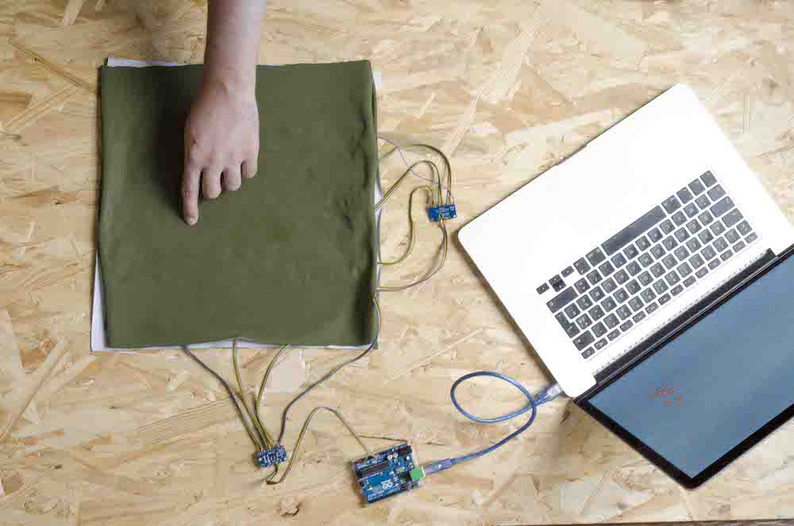

# LeFeel Music


Le téléphone mobile est le témoin de nos vies numériques. Capable de capter nos données comportementales, il les traite et les transforme en informations. Et si des textiles pouvaient jouer le même rôle ?

Suivez ce tutoriel pour fabriquer un textile qui capte la pression du toucher et la transforme en musique.

Le tissu mis au point est inspiré des recherches du collectif Humain–Humain. Il permet à un couple éloigné géographiquement d'entretenir un lien physique à distance. Il est capable de capter et retranscrire une caresse. L'objet permet d’apporter de l’affection n’importe où et n’importe quand.

Plusieurs applications sont possibles. Le textile peut servir à détecter les comportements des usagers à sa surface (par exemple : une personne qui le manipule, qui tombe ou qui marche dessus). Il peut aussi être disposé à divers endroits pour en modifier son usage (par exemple : sur un siège, un lit, l'arrière d'un sac à dos).

A vous de voir quel usage vous souhaitez en faire !

Il s'agit d'un tutoriel de niveau 2 présupposant que vous avez des connaissances pour installer des librairies et uploader du code sur les logiciels Arduino et Processing. Savoir souder et des notions en programmation sont un plus.

Vous avez maintenant toutes les informations afin de vous lancer dans ce tutoriel, à vous de jouer !


## Comment fabriquer un controller midi en Textile

#### Matériel

Liste des composants :

* 1x Arduino Uno
* 1x Usb cable type B
* 1x [Scotch conducteur](https://www.adafruit.com/product/1128) (~ 8m)
* 2x Tissu en coton (35x35cm)
* 1x [Velostat](https://www.adafruit.com/product/1361) (30x30cm)
* 2x [Adafruit MPR121](https://www.adafruit.com/product/1982) (12 Cap Touch breakout boards)
* Câbles (~ 5m)


 
Outils :

* Fer à souder
* Étain
* Ciseaux
* Pince à dénuder
* Réglet de 30 cm


### FABRIQUER LE TEXTILE

#### Préparer le textile

Dans un tissu, découpez deux carrés de 35 x 35 cm.

Puis coupez 24 bandes de scotch de cuivre de 30 cm chacune.


#### Axe X

Sur le premier textile, collez horizontalement 12 bandes de scotch de cuivre de 30 cm espacées chacune d’un centimètre en commençant par le milieu.


Résultat :


#### Axe Y

Faites de même sur l’autre textile en orientant cette fois les bandes de cuivre verticalement.


Résultat :


### SOUDER LE TEXTILE AUX CAPTEURS

#### Souder des câbles aux textiles

Prenez 12 fils d’environ 30 cm et dénudez les à l’aide de la pince.


Étamez chaque fil pour faciliter la soudure sur les bandes de cuivre.


Puis, étamez chaque bande de cuivre d’un seul côté.


Enfin, soudez les fils sur les bandes de cuivre.


Résultat :


**Répétez l’opération sur le deuxième tissu.**

#### Assembler les Axes aux capteurs capacitifs

Soudez les rangées de l’Axe X à la partie de la carte électronique correspondante en faisant attention à l’ordre des fils. Le premier câble sur la pin 0 et ainsi de suite jusqu’à la pin 11.


**Faire de même pour les rangées de l’Axe Y.**

### RELIER LES CAPTEURS À L’ARDUINO

#### SDA/SCL

Il faut maintenant relier les capteurs entre eux puis à la carte électronique.

4 pins seront utiles :

* SCL : Serial Clock pin, utilisée pour horodater les données du capteurs
* SDA : Serial Data, pin utilisée pour faire transiter les données
* GND : Ground, la masse pour fermer le circuit
* VIN : Tension en entrée utilisée pour alimenter le capteur


Sur le capteur de l’Axe Y, soudez un câble d’une longueur de 30 cm sur chacune des pins SCL, SDA, GND et VIN. Chaque câble se connectera au capteur de l'Axe X sur la pin correspondante. 

Avant de souder les câbles de l’Axe Y dans les pins de l’Axe X, ajoutez un nouveau câble par pin, de façon à les doubler comme sur la photo. Ces nouveaux câbles se connecteront à l’Arduino.

À la terminaison des 4 câbles qui se brancheront sur l’Arduino, soudez des headers :

* 2 pour les câbles SDA et SCL
* 2 pour les câbles GND et VIN


#### Adressage des capteurs

Pour que la carte Arduino différencie les deux capteurs, il faut que leurs adresses soient différentes.

Il y a quatre façons d’adresser les capteurs en changeant la valeur de la pin ADDR :

1. en ne lui branchant aucun câble, la pin aura l’adresse 0x5A
2. en lui connectant la Pin 3vo, son adresse sera 0x5B
3. en lui branchant la pin SDA, son adresse sera 0x5C
4. en lui connectant la pin SCL, son adresse sera 0x5D


Dans notre cas, vous devez connecter un petit cable entre la pin Addr et la pin 3vo sur le capteur de l’axe Y. Le capteur de l’Axe Y aura donc l’adresse 0x5B. Aucun câble n’est branché sur la pin ADDR du capteur de l’axe X, son adresse est donc 0x5A.


Résultat :


#### Connexion à l’Arduino

Branchez le câble qui vient de la pin SCL sur la Pin A5 de l’arduino puis la pin SDA sur la Pin A4 de l’arduino.

Puis branchez la pin GND du capteur qui correspond à la masse sur une des pins GND de l’arduino.

Enfin connectez la pin VIN du capteur sur la pin 5v de l’arduino qui alimentera les capteurs


### PROGRAMMER L’ARDUINO

Les sources du programme peuvent être téléchargées ici >
[https://github.com/humain-humain/lefeel](https://github.com/humain-humain/lefeel)

Le programme arduino utilise une librairie pour faire fonctionner les capteurs capacitifs MPR121, la première étape est donc de les installer. 

Après avoir redémarré arduino, chargez le code dans la carte.
Des explications sur le programme sont données directement dans le code Arduino.


### VISUALISER LE TEXTILE SUR UN ORDINATEUR

#### Finaliser le prototype

Ajoutez la feuille de velostat entre les deux tissus.

Placez l’Axe X en dessous et orientez le à la verticale.
Placez le velostat et enfin mettez l’Axe Y par dessus les bandes de cuivre orientées horizontalement et face au velostat




Résultat :


#### Faire du textile un controller Midi

##### Création d’un bus Midi

http://one-billion-cat.com/documentation_midi

##### Configuration de processing

Installez la librairie "themidibus" dans votre dossier processing/libraries/

Lancez le sketch processing et modifiez la chaîne de caractères "device_port" pour qu'elle corresponde au port où est connecté l'Arduino.

```
String device_port = "/dev/cu.usbmodem1421";
```


##### Configuration de GarageBand

Sur GarageBand, créez un nouveau projet, en choisissant collection de claviers.


Sur la première piste, devrait être affiché le " Steinway Grand Piano ", un piano classique parfait pour tester le prototype. 

Sélectionnez cette piste et revenez sur processing.


Assurez-vous que l'Arduino est connecté à l'ordinateur sur le bon port, lancez le sketch processing et jouez !

### ALLER PLUS LOIN

Maintenant que la surface sensible est créée, elle peut servir dans diverses applications :

* Interagir avec différents appareils numériques comme dans le [projet Jacquard](https://atap.google.com/jacquard/) de Google
* Capter des positions comme sur la [matrice resistive](https://etextile.github.io/resistiveMatrix/) du designer Maurin Donneaud,
* Analyser une posture selon la pression exercée ou servir de podomètre dans le cadre du projet [TexiSense](http://www.texisense.com/capteur_en).

Le textile pourrait disposer de capteurs supplémentaires sur chaque axe grâce à un [Multiplexeur](https://learn.adafruit.com/adafruit-tca9548a-1-to-8-i2c-multiplexer-breakout/overview), lui permettant d'avoir 64 capteurs sur une seule carte arduino. Les électrodes en scotch de cuivre peuvent aussi être remplacées par d'autres matériaux conducteurs comme du [fil d'argent](https://www.adafruit.com/product/641) ou du [graphène](https://www.adafruit.com/product/1309) pour un textile transparent. La taille de la surface textile peut aussi varier.

Enfin, le dispositif présenté dans ce tutoriel est un capteur. Il lui a été branché un controller midi mais il est possible de varier la retransmission :

* Les Touchés sur le textile, pourraient être envoyés via le réseau pour activer un dispositif à l'autre bout du monde,
* Le contact avec le tissu pourrait être analysé pour en déduire les comportements des utilisateurs,
* Les touchés sur la surface pourraient être transformés en clavier ou en souris d'ordianteur.

Voilà quelques interactions qui seraient envisageables avec ce textile sensible mais de nombreuses autres sont possibles. 

En espérant que ce guide vous ai plu. N'hésitez pas à partager vos réussites et les nouveaux usages du textile sur les réseaux avec hashtag [#lefeel](https://twitter.com/search?f=tweets&vertical=default&q=%23lefeel&src=typd) et [@Le3eLieu](https://twitter.com/Le3eLieu).
